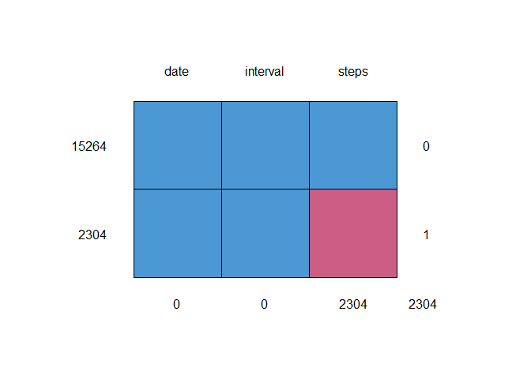

## Loading and preprocessing the data


```r
library(here)
library(lubridate) # For working with date and time
library(dplyr)
library(lattice)
library(mice) # For imputation
library(VIM) # For imputation
library(stringr) # Find and replace strings in dataframe
```


```r
ok_wd <- getwd()
file_csv <- here(ok_wd, "activity.csv") 
activity <- read.csv(file_csv)
activity$date <- ymd(activity$date) # Transform 'date' variable
```

## What is mean total number of steps taken per day?

1. Make a histogram of the total number of steps taken each day


```r
total_step <- activity %>% group_by(date) %>% summarise(total = sum(steps, na.rm = TRUE))
hist(total_step$total, breaks = 8, xlab = "Steps", main = "Total number of steps taken each day")
```

<!-- -->

2. Calculate and report the mean and median total number of steps taken per day


```r
mean_step_happy <- activity %>% group_by(date) %>% summarise(mean_happy = mean(steps, na.rm = TRUE))
median_step_happy <- activity %>% group_by(date) %>% summarise(median_happy = median(steps, na.rm = TRUE))

par(mfrow = c(1, 2), mar = c(5, 4, 5, 2))
plot(mean_happy ~ date, mean_step_happy, pch = 21, xlab = "Time", ylab = "Steps", main = "Mean number of steps taken each day", cex.main = 0.8)
plot(median_happy ~ date, median_step_happy, pch = 21, xlab = "Time", ylab = "Steps", main = "Median number of steps taken each day", cex.main = 0.8)
```

<!-- -->

## What is the average daily activity pattern?

1. Make a time series plot (i.e. type = "l") of the 5-minute interval (x-axis) and the average number of steps taken, averaged across all days (y-axis)


```r
time_series_happy <- activity %>% group_by(interval) %>% summarise(mean_happy = mean(steps, na.rm = TRUE))

yes_interval <- subset(time_series_happy, mean_happy == max(mean_happy))

plot(mean_happy ~ interval, data = time_series_happy, type = "l", col = "black", xlab = "Interval", ylab = "Steps", main = "Time series of average number of steps taken")

abline(v = yes_interval$interval, col="red", lty = 2)
```

<!-- -->

2. Which 5-minute interval, on average across all the days in the dataset, contains the maximum number of steps? It is at 835th 5-min interval with average steps 206 as the red dashed line shown in the graph.

## Imputing missing values

1. Calculate and report the total number of missing values in the dataset (i.e. the total number of rows with NAs) 


```r
activity_ok <- summary(activity)
activity_ok <- as.data.frame(activity_ok)
number_na_value_step <- as.numeric(gsub('.*:', '', activity_ok[7,3]))
```

The total number of NAs is 2304


```r
md.pattern(activity)
```

<!-- -->

```
##       date interval steps     
## 15264    1        1     1    0
## 2304     1        1     0    1
##          0        0  2304 2304
```

```r
aggr(activity, prop = T, numbers = T)
```

<!-- -->

2. Devise a strategy for filling in all of the missing values in the dataset. The strategy does not need to be sophisticated. For example, you could use the mean/median for that day, or the mean for that 5-minute interval, etc.

I make imputation for this dataset using method `pmm` as Predictive mean matching using `mice` package.

3. Create a new dataset that is equal to the original dataset but with the missing data filled in.


```r
activity_steps <- mice(activity, seed = 2468, printFlag = F)
activity_imputed <- complete(activity_steps, 1) # Select the first version of imputation dataset
```

4. Make a histogram of the total number of steps taken each day and Calculate and report the mean and median total number of steps taken per day. Do these values differ from the estimates from the first part of the assignment? What is the impact of imputing missing data on the estimates of the total daily number of steps?

The impact of imputing missing data on the estimates of the total daily number of steps is to make the histogram less skewness and to become as standard distribution chart as well as helps connect the missing dots in the original chart thereby smoothing the line.


```r
total_step_imputed <- activity_imputed %>% group_by(date) %>% summarise(total = sum(steps, na.rm = TRUE))

par(mfrow = c(1, 2), mar = c(5, 4, 5, 2))

hist(total_step$total, breaks = 8, xlab = "Steps", main = "Before imputation", cex.main = 0.8)

hist(total_step_imputed$total, breaks = 8, xlab = "Steps", main = "After imputation", cex.main = 0.8)

mtext("Total number of steps taken each day", side = 3, line = -2, outer = TRUE)
```

<!-- -->

For mean values, the imputated values (shown in blue dots) seem fitting to the overal trend of the original mean graph. While median values does not change its value, they stay in zeros because a number of zero step taken in each day rather than step-recorded values.


```r
mean_step_imputed <- activity_imputed %>% group_by(date) %>% 
        summarise(mean_imputed = mean(steps, na.rm = TRUE))

ok_mean <- cbind(mean_step_happy, mean_step_imputed)
yes_1 <- subset(ok_mean, mean_happy == "NaN")
yes_mean <- yes_1 %>% select(date, mean_imputed)

plot(mean_imputed ~ date, mean_step_imputed, xlab = "Time", ylab = "Steps", main = "Mean number of steps taken each day", ylim = c(0, 110))
points(mean_imputed ~ date, data = yes_mean, col = "blue", pch = 16)
legend("topright", pch = c(21, 16), col = c("black", "blue"), legend = c("Original", "Imputation"), cex = 0.8, bg = "transparent")
```

<!-- -->


```r
median_step_imputed <- activity_imputed %>% group_by(date) %>% 
        summarise(median_imputed = median(steps, na.rm = TRUE))

ok_median <- cbind(median_step_happy, median_step_imputed)
ok_median[is.na(ok_median)] <- "missing value"
yes_2 <- subset(ok_median, median_happy == "missing value")
yes_median <- yes_2 %>% select(date, median_imputed)

plot(median_imputed ~ date, median_step_imputed, xlab = "Time", ylab = "Steps", main = "Median number of steps taken each day")
points(median_imputed ~ date, data = yes_median, col = "blue", pch = 16)
legend("topright", pch = c(21, 16), col = c("black", "blue"), legend = c("Original", "Imputation"), cex = 0.8, bg = "transparent")
```

<!-- -->


```r
plot(mean_imputed ~ date, data = mean_step_imputed, type = "l", col = "red", 
     xlab = "Time", ylim = c(0, 100), ylab = "Steps", main = "Time series of average number of steps taken")

lines(mean_happy ~ date, data = mean_step_happy, type = "l", col = "black", 
     xlab = "Time", ylim = c(0, 90), ylab = "Steps", main = "Time series of average number of steps taken")

legend("topright", lty = 1, col = c("black", "red"), legend = c("Original", "Imputation"), cex = 0.8, bg = "transparent")
```

<!-- -->

## Are there differences in activity patterns between weekdays and weekends?

1. Create a new factor variable in the dataset with two levels -- "weekday" and "weekend" indicating whether a given date is a weekday or weekend day.


```r
activity_week <- activity_imputed %>% mutate(status = weekdays(date))

activity_week$status <- str_replace_all(activity_week$status, "Monday", "weekday") 
activity_week$status <- str_replace_all(activity_week$status, "Tuesday", "weekday")
activity_week$status <- str_replace_all(activity_week$status, "Wednesday", "weekday")
activity_week$status <- str_replace_all(activity_week$status, "Thursday", "weekday")
activity_week$status <- str_replace_all(activity_week$status, "Friday", "weekday")
activity_week$status <- str_replace_all(activity_week$status, "Saturday", "weekend")
activity_week$status <- str_replace_all(activity_week$status, "Sunday", "weekend")
activity_week$status <- as.factor(activity_week$status)
```

2. Make a panel plot containing a time series plot (i.e. type = "l") of the 5-minute interval (x-axis) and the average number of steps taken, averaged across all weekday days or weekend days (y-axis). 


```r
yes_step_interval <- activity_week %>% group_by(interval, status) %>% 
        summarise(steps = mean(steps, na.rm = TRUE))
```

```
## `summarise()` has grouped output by 'interval'. You can override using the
## `.groups` argument.
```

```r
xyplot(steps ~ interval | status, data = yes_step_interval, 
        layout = c(1,2), type = list("l"))
```

<!-- -->
